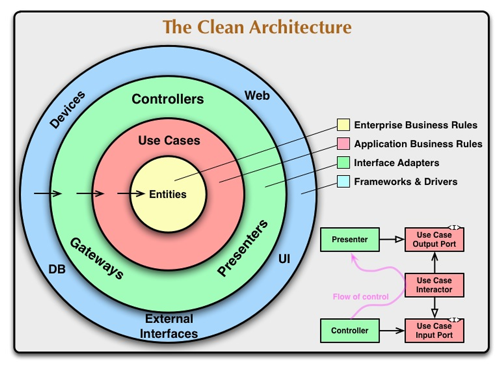
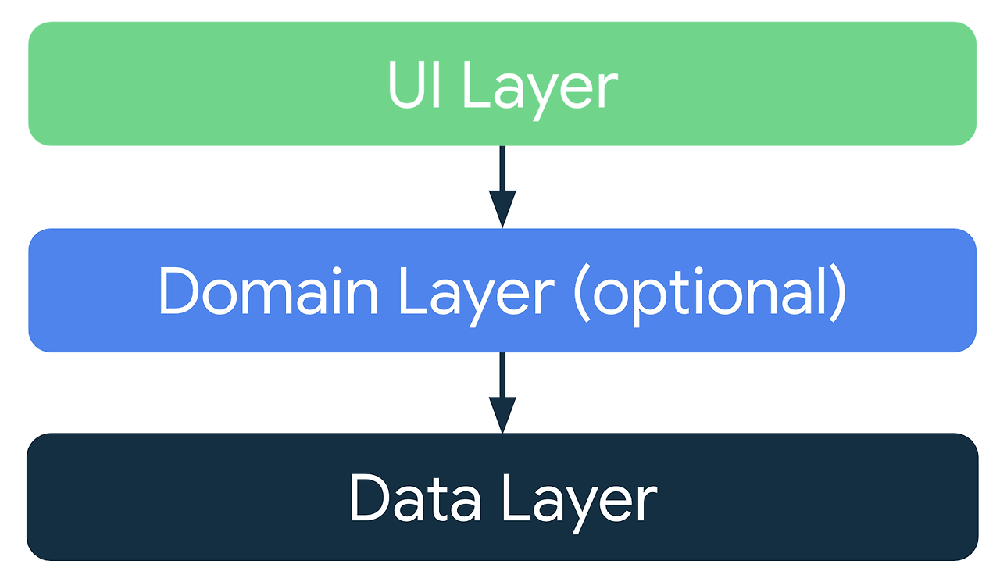
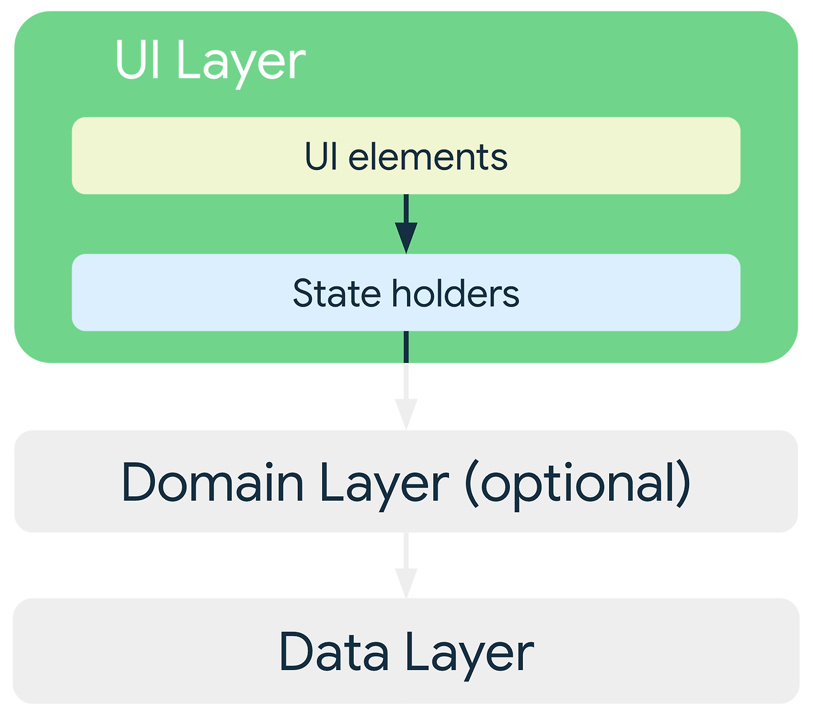
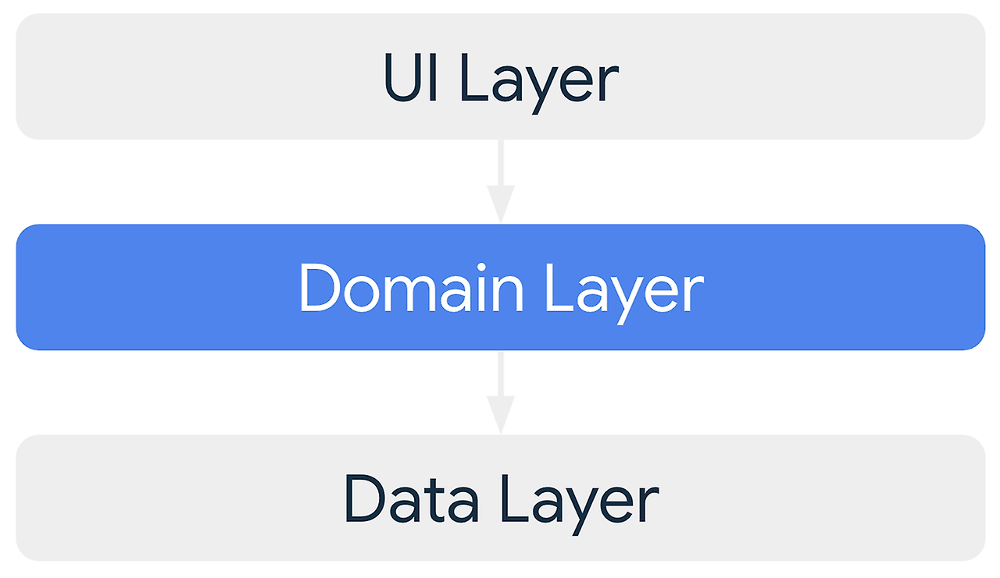
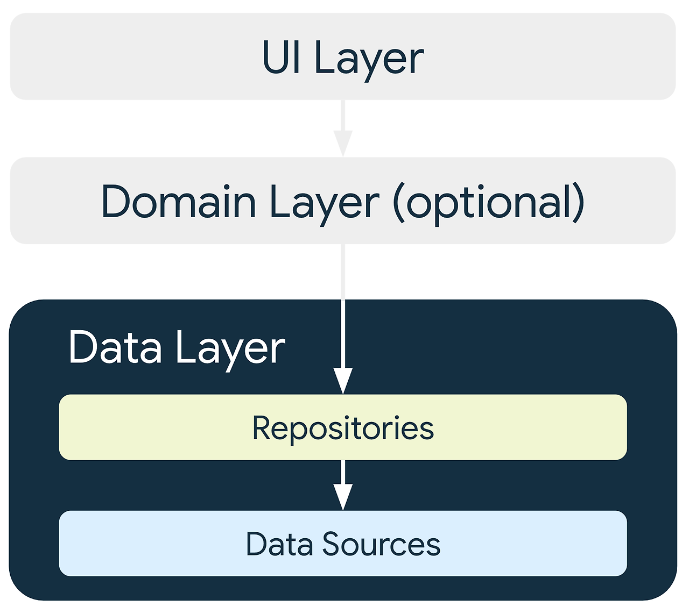
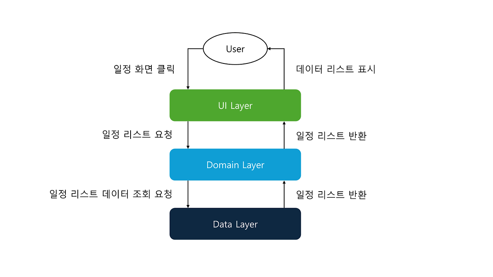
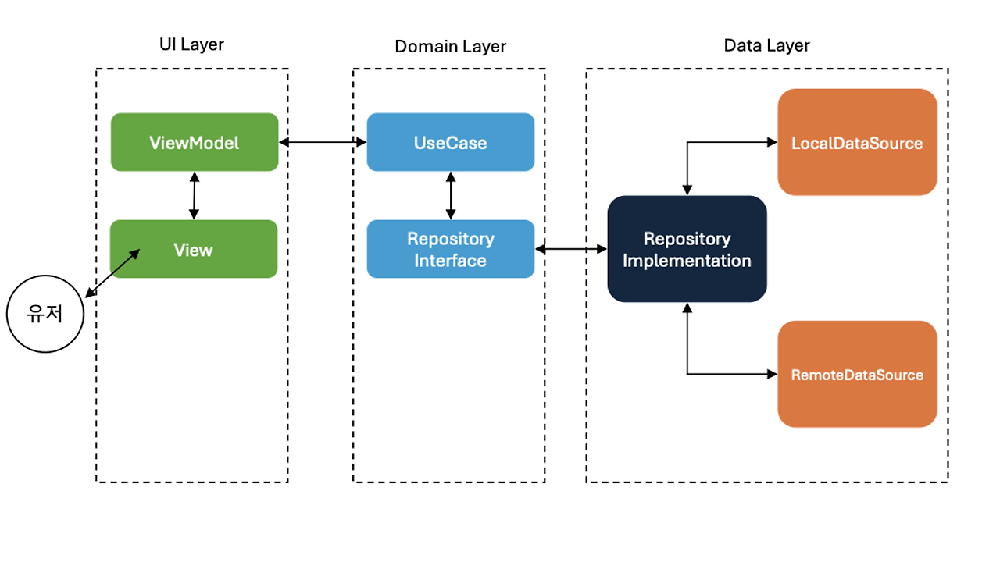

:::info

이 글은 나모 팀블로그에 동시에 게시되어 있습니다.

[나모의 클린하고 싶은 아키텍처](https://namo-log.vercel.app/android-clean-architecture)

:::

안녕하세요! **나모**의 안드로이드 개발자 짱구입니다.

**23년 12월 31일,** 마참내! **나모(안드로이드)**가 런칭 되었습니다. 하지만, 런칭 직후 발견된 버그들이 있었고, 개선되어야 할 기능들이 추가되면서.. 유지보수 및 리팩토링의 필요성을 느끼게 되었습니다.

#### **기왕 하는 김에 제대로 한번 해보자!**


회의 끝에 기존 사용하던 MVC 구조를 갈아엎고 유지보수에 용이한 **클린 아키텍처**를 도입해보기로 결정했습니다. (공부도 할 겸 ^^7)

이번 포스트에서는 클린 아키텍처와 나모에서 이를 어떻게 사용하고 있는지 소개해드리려 합니다.

# **클린 아키텍처?**

클린 아키텍처란 애플리케이션의 유지보수성, 확장성, 그리고 독립성을 높이기 위해 설계된 소프트웨어 아키텍처입니다. 클린 아키텍처의 핵심 아이디어는 소프트웨어를 여러 계층으로 분리하여, 각 계층이 서로 독립적으로 유지될 수 있도록 하는 것입니다.



## **주요 원칙**

-   **의존성 역전 원칙:** 고수준 모듈은 저수준 모듈에 의존해서는 안되며, 양쪽 모듈 모두 추상화에 의존해야 합니다. 이를 통해 느슨한 결합을 유지할 수 있습니다.
-   **경계의 분리:** 관심사의 분리를 통해, 애플리케이션의 다른 부분 사이의 종속성을 최소화합니다.
-   **인터페이스 분리 원칙:** 비즈니스 로직은 구체적인 구현으로부터 추상화 되어야 하며, 이를 통해 비즈니스 규칙이 외부 변화에 영향을 받지 않도록 보호합니다.


_클린 아키텍처는 간단하게만 소개하겠습니다._

___

## **안드로이드에서의 클린 아키텍처**

사실 안드로이드에서 클린 아키텍처를 사용한다! 라고 하면 국룰처럼 통하는 방법론이 있습니다.

이 문서에서 강조하는 것은 바로 **관심사의 분리**입니다.

안드로이드 앱 아키텍처에는 3가지 레이어가 존재하고, 각각 **분명한 책임**을 가지고 있습니다.



1.  **UI 레이어 (Presentation 레이어):** UI와 관련된 부분을 담당합니다. 사용자의 입력을 처리하고 화면에 데이터를 표시하는 역할을 합니다.
2.  **Domain 레이어:** 애플리케이션의 비즈니스 로직을 담당하는 부분입니다. UI와 Data 레이어 사이에서 중개자 역할을 합니다.
3.  **Data 레이어:** 데이터와의 상호 작용을 관리합니다. 네트워크 API 호출, 로컬 데이터베이스 접근, 등 데이터 관련 작업을 수행합니다.

#### **UI 레이어**



> **주요 구성 요소**

-   **UI elements:** 말 그대로 UI의 뷰와 위젯을 말합니다. 사용자와의 상호작용을 입력받고 화면에 데이터를 렌더링합니다.
-   **State holder:** UI 관련 데이터 및 로직을 처리합니다. 대표적으로 ViewModel이 있습니다.

아키텍처 관점에서 봤을 때, UI 레이어에서 중요한 것은 바로 State Holder, **ViewModel** 입니다.

ViewModel은 LiveData나 StateFlow와 같은 Observable 데이터 홀더를 사용하여 데이터 변화를 관찰하고, UI 컨트롤러에 데이터 변화를 알립니다. 마치 유튜브 채널의 구독을 누르면 알림이 오는 것과 같이, UI 컨트롤러는 ViewModel의 알림을 통해 UI를 업데이트 합니다.

이런 방식으로 UI를 업데이트하여 최신 상태를 반영할 수 있고, UI쪽 코드를 단순화할 수 있습니다.

_(LiveData와 StateFlow는 추후에 다뤄보겠습니다..)_

#### **Domain 레이어**

도메인 레이어는 공식 문서에도 나와있듯이, 선택사항입니다. 복잡한 비즈니스 로직이나 여러 ViewModel에서 재사용되는 간단한 비즈니스 로직의 캡슐화를 담당합니다.



> **주요 구성 요소**

-   **Entity:** 엔터티는 비즈니스 로직의 핵심 데이터를 나타냅니다.
-   **UseCase :** 각 UseCase는 특정 비즈니스 로직을 캡슐화하고, 사용자의 요청을 처리한 후 결과를 UI 레이어에 전달합니다.
-   **Repository Interface:** 도메인 레이어는 데이터 레이어로부터 데이터를 요청하기 위해 인터페이스를 사용합니다. 이 인터페이스를 통해, 데이터 레이어의 구체적인 구현에 의존하지 않고 데이터를 요청할 수 있습니다. 실제 구현은 데이터 레이어에서 담당합니다. (의존성 역전 법칙)

#### **Data 레이어**

데이터 레이어는 클린 아키텍처에서 애플리케이션의 데이터와 관련된 모든 작업을 담당합니다. 네트워크 API 호출, 로컬 데이터베이스 접근 작업 등이 포함됩니다.



> **주요 구성 요소**

-   **Repository:** 레포지토리는 데이터 소스에게 데이터를 요청하고, 처리한 후에 애플리케이션의 다른 부분에 제공하는 역할을 합니다. 일반적으로는 도메인 레이어 혹은 UI 레이어의 ViewModel이 되겠습니다.
-   **DataSource:** 데이터 레이어는 일반적으로 두 가지 유형의 데이터 소스를 다룹니다. 하나는 로컬 데이터베이스(ex: Room) 다른 하나는 원격 API(ex: Retrofit)입니다. 각 데이터 소스는 구체적인 데이터 접근 매커니즘을 구현합니다.

#### **데이터 흐름**

위에서 설명한 각 레이어를 사용하여 실제 데이터 흐름을 간단한 예시로 보면 이렇습니다.



#### **그래서 왜 사용하는가?**


1.  **분리된 관심사:** 클린 아키텍처는 데이터, 비즈니스 로직, UI 등 애플리케이션의 다양한 관심사를 분리하여 설계합니다. 특정 기능이나 컴포넌트의 수정이 필요할 때 해당 부분만을 집중적으로 다룰 수 있기 때문에 유지보수를 용이하게 합니다.
2.  **확장성:** 각 레이어와 컴포넌트는 독립적으로 구성되어 있어, 새로운 기능을 추가하거나 기존 기능을 수정할 때 기타 컴포넌트에 미치는 영향을 최소화합니다. 이는 애플리케이션의 확장이나 변경에 있어 높은 유연성을 제공합니다.
3.  **테스트 용이성:** 클린 아키텍처는 비즈니스 로직을 UI나 데이터베이스 로직으로부터 분리하여, 단위 테스트를 용이하게 합니다.  
    _(하지만.. 우리 팀은 아직 테스트 코드는 활용하고 있진 않습니다.)_
4.  **장기적인 안정성과 유연성:** 클린 아키텍처는 의존성 역전 원칙을 적용하여, 고수준 모듈이 저수준 모듈의 구현 세부사항에 의존하지 않도록 합니다. 이로 인해, 외부 라이브러리나 데이터베이스 등의 변경이 애플리케이션의 핵심 비즈니스 로직에 미치는 영향을 최소화합니다.

#### **결국은 유지보수에 용이하기 때문!**

___

## **나모에서의 클린 아키텍처**



그렇다면 나모에서는 어떻게 활용하고 있을까요? 앞서 설명한 내용과 크게 다르지는 않습니다.

**UI 레이어**

- **View:** 유저와 상호작용을 담당합니다.

- **ViewModel:** UI 관련 데이터 및 로직을 처리합니다.

**Domain 레이어**

- **UseCase:** ViewModel의 요청을 받아서 Repository에게 데이터를 요청합니다.  
일반적으로는 사용되지 않지만, 재상용이 가능한 로직들에 한해서 사용됩니다.

- **Repository:** UseCase 혹은 ViewModel에게 데이터를 요청 받습니다. 실제 구현은 데이터 레이어에서 담당합니다.

**Data 레이어**

룸디비와 서버 통신을 함께 사용하고 있어서 Local과 Remote 데이터 소스를 사용하고 있습니다.

- **Repository Implementation:** 구현체는 데이터 소스에게 데이터를 요청받아 처리합니다.

- **RemoteDataSource:** Retrofit api 호출을 담당합니다. 데이터를 가공하여 Repository에게 반환해줍니다.

- **LocalDataSource:** 실제 DAO 메서드를 호출을 담당합니다. 마찬가지로 Repository에게 반환해줍니다.

#### **사용 예시**

#### 기록 추가 api를 사용하는 예시와 함께 살펴보겠습니다.

1. View에서 기록 추가 버튼을 클릭하면, ViewModel의 addDiary 함수를 호출합니다.

```kotlin
binding.diaryBtn.setOnClickListener {
  viewModel.addDiary()
}
```

2. ViewModel에서는 Repository의 addDiary를 호출합니다. _(Hilt나 코루틴도 추후에 다뤄보겠습니다..)_

```kotlin
@HiltViewModel
class PersonalDiaryViewModel @Inject constructor(
  private val repository: DiaryRepository
) : ViewModel() {

  private val _diary = MutableLiveData<Diary>()
  val diary: LiveData<Diary> = _diary

  fun addDiary() {
    viewModelScope.launch {
      repository.addDiary(_diary.value, _imgList.value)
    }
  }
}
```

3. 이때 Repository는 Interface로 구성되고 도메인 레이어에 위치하게 됩니다.

```kotlin
interface DiaryRepository {
  suspend fun addDiary(
    diary: Diary,
    images: List<String>?
  )
}
```

4. 데이터 레이어에 위치한 Repository의 구현체에서 인터넷 연결 여부에 따라 DataSource를 호출합니다.

```kotlin
override suspend fun addDiary(
  diary: Diary,
  images: List<String>?
) {
  localDiaryDataSource.addDiary(diary)
  if (networkChecker.isOnline()) {
    val addResponse = remoteDiaryDataSource.addDiary(diary, images)
    if (addResponse.code == SUCCESS_CODE) {
        localDiaryDataSource.updateDiaryAfterUpload(
        localId = diary.diaryId,
        serverId = addResponse.result.scheduleId,
        IS_UPLOAD,
        RoomState.DEFAULT.state
      )
    }
  }
}
```

5. Local에선 DAO를, Remote에선 Retrofit을 호출하여 데이터를 가져옵니다. - 예시로 RemoteDataSource

```kotlin
class RemoteDiaryDataSource @Inject constructor(
  private val apiService: DiaryApiService,
  private val context: Context
) {
  suspend fun addDiaryToServer(
    diary: Diary,
    images: List<String>?,
  ): DiaryAddResponse {
    var diaryResponse = DiaryAddResponse(result = GetScheduleIdx(-1))

    withContext(Dispatchers.IO) {
      runCatching {
        apiService.addDiary(
          scheduleId = diary.scheduleServerId.toString().convertTextRequest(),
          content = (diary.content ?: "").convertTextRequest(),
          imageToMultipart(images, context)
        )
      }.onSuccess {
        Log.d("RemoteDiaryDataSource addDiaryToServer Success", "$it")
        diaryResponse = it
      }.onFailure {
        Log.d("RemoteDiaryDataSource addDiaryToServer Failure", "$it")
      }
    }

    return diaryResponse
  }
}
```

6\. 가져온 데이터를 사용해서 View에서 UI를 업데이트 합니다. 조회 api였다면 ui에 변경된 데이터를 뿌려줬겠지만, 여기선 기록 추가 액티비티를 종료해줍니다.

```kotlin
viewModel.diary.observe(this) { diary ->
  if(diary != null) finish()
}
```

___

## **원칙과 유연함**


굉장히 유연한 고양이

앞에서 열심히 클린아키텍처를 설명했지만, 사실 이 모든 걸 엄격하게 사용할 필요는 없습니다. 모든 프로젝트가 같은 구조일 수도, 그럴 필요도 없습니다.

위의 예시에서는 재사용될 일이 없는 코드이기 때문에 UseCase는 사용하지 않았습니다. 또한 앱의 규모나, 복잡성을 생각하여 DataSource를 interface를 사용하지 않고 사용했습니다. 처음 클린 아키텍처를 적용하기 때문에 학습량을 고려하여 레이어를 분리하는 대신 패키지로만 구분하기도 했습니다. 점진적으로 아키텍처를 적용할 수도 있습니다.

_**참으로 어려운 일이지만..**_

앱의 규모, 기술 스택, 팀의 경험, 프로젝트의 복잡성을 고려하여 **상황에 맞게 아키텍처를 선택**하여 유연하게 사용해야 합니다. 아키텍처를 사용하기 위해 프로젝트를 하는 것이 아니라, 프로젝트를 유지보수하기 위해 아키텍처를 사용하는 것입니다. 앞으로도 아키텍처를 상황에 맞게, 근거를 가지고 고민하여 적절히, 유연하게 사용하려고 노력하면서 개발을 진행하려 합니다. 그에 따른 이슈나 기술 사용 경험 등을 이후 포스트들로 나누도록 하겠습니다.

감사합니다!