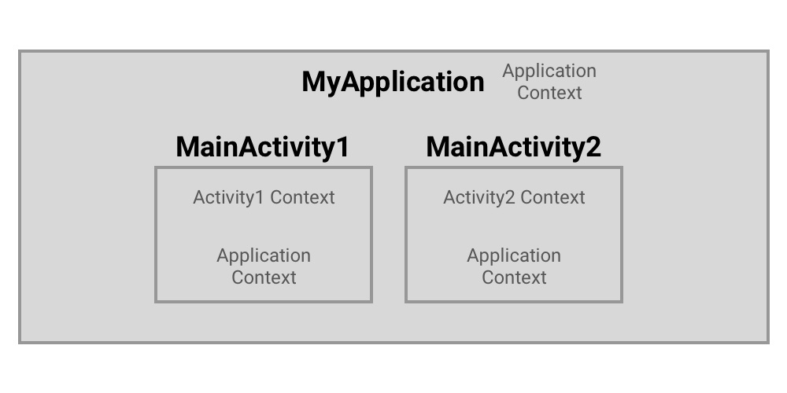

## Context란?

Context는 직역하면 애플리케이션의 현재 상태의 맥락(context)입니다. 객체가 현재 어떤 일이 일어나고 있는지에 대한 정보를 제공하는 인터페이스입니다. 안드로이드에서 Context는 리소스를 가져오거나 View와 관련된 작업을 별도의 클래스나 함수로 분리하기 위해 파라미터로 Context로 넘기는 등 애플리케이션 내에서 매우 광범위하게 사용됩니다.

-   광범위하게 사용된다는 것은 라이프 사이클을 고려해야 된다는 것과 이어질 수 있는데,  Context는 잘못 사용하면  애플리케이션의 메모리 누수를 발생시킬 수 있으므로 매우 주의해야 합니다.

## **Context 종류**

1.  **Application Context** : 애플리케이션과 생명 주기가 연결되어 있는 싱글톤 인스턴스로, `getApplicationContext()`를 통해 접근할 수 있습니다. 주로 액티비티의 생명주기와 분리된 컨텍스트가 필요한 경우에 사용됩니다.
    -   Ex : 싱글톤 객체가 필요하고 해당 객체가 컨텍스트를 필요로 하는 경우에는 항상 애플리케이션 컨텍스트를 전달해야 합니다. 만약 이런 상황에서 Activity context를 사용한다면, 메모리 누수가 발생할 수 있습니다.
2.  **Activity Context** : Activity의 생명 주기와 연결되어 있으며, `View.getContext()`를 통해 현재 실행되고 있는 View의 Context(보통 현재 활성화된 Activity의)에 접근할 수 있습니다. 액티비티의 범위 내에서 Context를 전달할 때 사용됩니다.