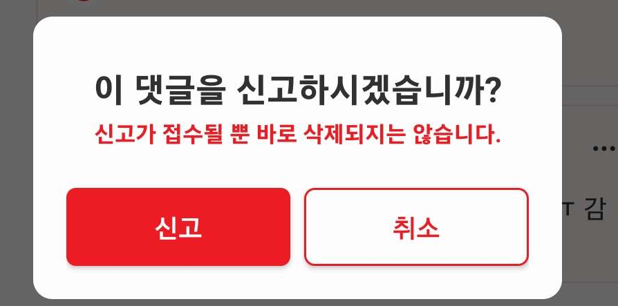
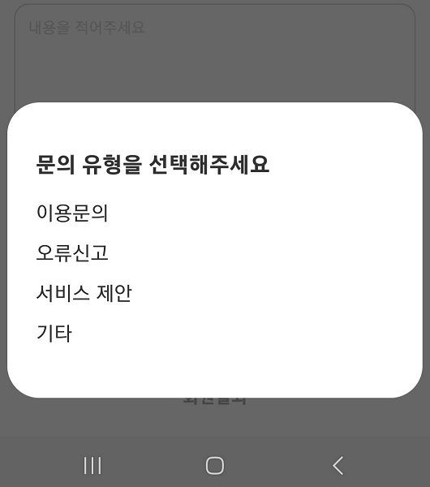

안드로이드에서 다이얼로그는 사용자에게 다양한 상황에서 메시지를 표시하거나, 선택을 요청하는 등의 역할을 하는데 사용되는데, 이 글에서는 DialogFragment와 BottomSheetDialogFragment에
대해서 알아보겠습니다.

## DialogFragment

DialogFragment는 다이얼로그를 보여주기 위해 설계된 Fragment의 하위 클래스입니다.



위 다이얼로그는 커스텀한 것

DialogFragment를 사용하면 FragmentManager가 다이얼로그의 상태를 관리하고 구성이 변경됐을 때 자동으로 복원할 수 있습니다.

DialogFragment를 구현하기 위해서는 DialogFragment를 확장하는 클래스를 생성하고, onCreateDialog()를 오버라이드 해야 합니다.

```kotlin
class DialogFragment : DialogFragment() {
  override fun onCreateDialog(savedInstanceState: Bundle?): Dialog =
    AlertDialog.Builder(requireContext())
      .setMessage(getString(R.string.order_confirmation))
      .setPositiveButton(getString(R.string.ok)) { _,_ -> }
      .create()

  companion object {
    const val TAG = "Dialog"
  }
}
```

이후에 show() 메서드를 호출하여 dialog를 띄울 수 있습니다. 이 때, FragmentManger와 String 태그를 매개변수로 사용합니다.

```kotlin
DialogFragment().show(
  supportFragmentManager, DialogFragment.TAG)
```

## BottomSheetDialogFragment

BottomSheetDialogFragment는 지정된 위치에서 나타나는 다이얼로그와 다르게, 화면 하단에서 위로 슬라이드하는 애니메이션이 추가된 DialogFragment의 하위클래스입니다.



BottomSheetDialogFragment 클래스를 생성한 후에는 onCreateView 메서드를 오버라이드 해야합니다.

```kotlin
class BottomSheetDialogFragment: BottomSheetDialogFragment() {

  override fun onCreateView(
    inflater: LayoutInflater,
    container: ViewGroup?,
    savedInstanceState: Bundle?
  ): View? {
    return inflater.inflate(R.layout.bottom_sheet_fragment, container, false)
  }

  companion object {
    const val TAG = "BottomSheetDialogFragment"
  }
}
```

DialogFragment와 마찬가지로 `show()` 메서드를 호출하여 dialog를 띄울 수 있고, FragmentManger와 String 태그를 매개변수로 사용합니다.

```kotlin
BottomSheetDialogFragment().show(supportFragmentManager, BottomSheetDialogFragment.TAG)
```

> 관련 문서:
>
> [Android developers - dialog](https://developer.android.com/guide/fragments/dialogs)
>
> [Android developers - BottomSheetDialogFragment](https://developer.android.com/reference/com/google/android/material/bottomsheet/BottomSheetDialogFragment)
