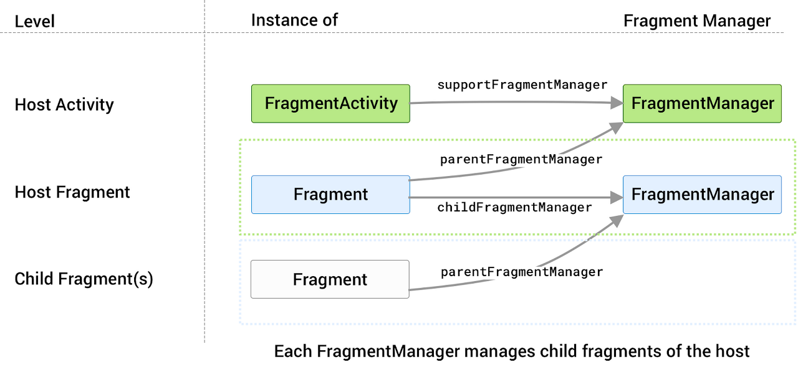

## FragmentManager란?

FragmentManager는 Fragment의 추가, 제거, 교체하고 백 스택에 추가하는 등과 같은 트랜잭션을 관리하는 클래스입니다. FragmentManager를 사용하면 Fragment의 라이프 사이클을 다루고, 백스택을 활용해 사용자의 이전 상태로 복귀하는 등의 작업을 수행할 수 있습니다.

## FragmentManager에 접근하기

FragmentManager는 모든 FragmentActivity와 그 subclass(AppCompatActivity)에서 `getSupportFragment()` 메서드를 통해 접근할 수 있습니다.액티비티가 아닌 프래그먼트에서도 FragmentManager에 접근하여 부모 컴포넌트(액티비티 또는 프래그먼트)나 자식 컴포넌트를 관리할 수 있습니다. 부모 컴포넌트는 `getParentFragmentManager()`를 통해서, 자식 프래그먼트는 `getChildFragment()`를 통해서 접근할 수 있습니다.



FragmentManger 계층구조

## FragmentManager 사용하기

FragmentManager를 이용하면 사용자의 상호작용에 따라 Fragment를 추가하거나 삭제하는 등 Fragment의 백 스택을 관리할 수 있습니다. 추가, 삭제 등의 변경사항들은 FragmentTransaction 을 하나의 단위로 커밋됩니다.

Framgent는 Activity와 달리 백 스택이 기본적으로는 쌓이지 않고 사용자가 뒤로가기 버튼을 누르면 이전 Activity로 넘어갑니다. `addToBackStack()`을 사용하면 Fragment의 트랜잭션이 백 스택에 커밋됩니다. 또한 popBackStack()을 사용하여 트랜잭션을 취소하고 이전 Fragment 화면을 가져올 수 있습니다.

### 기본 사용법 예시

#### 1\. 프래그먼트 추가하기

```kotlin
val fragmentManager = supportFragmentManager
fragmentManager.beginTransaction()
  .add(R.id.fragment_container, MyFragment())
  .addToBackStack("name")
  .commit()
```

#### 2\. 프래그먼트 교체하기

```kotlin
val fragmentManager = supportFragmentManager
fragmentManager.beginTransaction()
  .replace(R.id.fragment_container, AnotherFragment())
  .commit()
```

#### 3\. 프래그먼트 삭제하기

```kotlin
val fragmentManager = supportFragmentManager
fragmentManager.beginTransaction()
  .remove(myFragmentInstance)
  .commit()
```

> 관련 문서: [Android developers](https://developer.android.com/guide/fragments/fragmentmanager?hl=ko)
