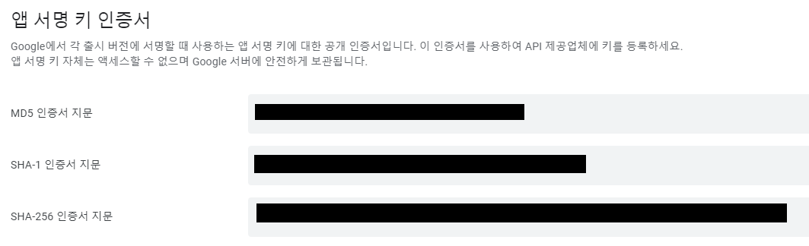

> **첫 앱 런칭을 해보며 있던 이야기를 기록해봅니다.**


## **시작**

휴학 중이던 나는 진로를 개발자 쪽으로 잡고 혼자 공부하기로 결심. 혼자 공부하는 것에 한계를 느끼고, 이대로 괜찮은가? 뇌내 속 비상 대책 위원회를 열었다. 나에게 강제성을 좀 부여하자라는 생각을 가지고 냅다 [UMC라는 연합 동아리](https://www.makeus.in/umc)에 지원했다. 마침 우리 학교에도 지부가 있었고, 앱을 런칭하는 마스터 코스가 있는 점이 혹했다. 하나의 프로젝트를 협업하면서 스토어에 올리기까지 나에게 있어서 좋은 기회가 될 것이라고 생각했다.

여차저차 10주간의 교육기간, 스터디를 마치고 팀 매칭에 들어갔다. 각 PM들의 앱 기획을 보고, 팀 매칭에서 나는 무조건! 데모데이가 목표가 아닌, 런칭까지 확실히 마무리를 목표로 하는 것을 우선 순위로 보았다. 가능하다면 유지보수나 업데이트도 경험해보고 싶었다. 다행히 1지망으로 생각했던 팀에 들어가게 되었고, 1월부터 앱 개발에 들어갔다.   

___

## **github**

개발을 시작하면서 처음 마주한 벽은 github였다. 나를 포함해서 거의 대부분이 github을 처음 써봤고, 사용법이 익숙치 않아 어려움을 많이 겪었다. 커밋, 푸쉬부터 시작해서 각자 레이아웃을 짜다가 처음으로 머지할 때는 너무 많은 conflict 때문에 고생했던 기억이 있다. 사실 처음부터 체계를 잘 만들고 전략을 세우고 시작했어야 했는데, 바로 각자 개발에 들어갔던게 문제였던..

그래서 첫 머지 이후 브랜치 전략을 어느정도 세우면서 개발하기 시작했다.

[우린 Git-flow를 사용하고 있어요 | 우아한형제들 기술블로그](https://techblog.woowahan.com/2553/)

(참고했던 블로그 글)

아직 런칭해서 유지보수나 신기능 개발하는 단계가 아니니까 대략적으로만 규칙을 세웠다.

1. 항상 있는 root 브랜치 = dev

2. 개발할 때는 항상 features 브랜치를 파서 개발하기

3. features 브랜치에 개발하고 나서 자신의 pull request는 꼭 본인이 merge하기

4. features 브랜치의 수명은 짧게 가져가기   

이후에는 github를 쓰는데 큰 문제는 없었다. 하지만, features 브랜치를 파는걸 까먹고 dev에서 푸쉬한다던가.. 브랜치명과 다른 부분의 코드를 개발해서 push 한다던가.. features 브랜치의 수명을 짧게 가져가야 하는데 하다보니 오래 끌어버려서 원기옥 커밋을 해버린다던가 규칙이 가끔씩 안지켜지는 부분들이 있었다.

앞으로 있을 유지보수 기간에는 안지키는 팀원이 있으면 말해준다던지 브랜치 규칙을 꼭 지키면서 개발을 이어나가야 겠다. 그리고 우리가 처음 github를 써봐서 대략적으로만 브랜치 전략을 세워서 개발했지만, 다른 브랜치 규칙을 알아봐야겠다.

이번 프로젝트를 하면서 어느정도 익히긴 했지만, github는 앞으로 할 팀 프로젝트들에서나 나중에 실무에서나 기본적으로 활용할 줄 알아야 하기 때문에.. 꼭 더 익혀놔야 할 거 같다.   

___

## **개발**

개발에 들어가기 앞서 우리가 교육 과정/스터디에서 배운 것들을 좀 넘어서 좀 더 심화된 기술을 써보고 싶다는 의견이 나왔다. 우리 안드로이드 팀도 다들 동의해서 도전해보기로 했다. 그리하여 스터디하면서 개발하기 시작. 우리 팀이 쓰기로 결정 한 것은 크게 세 가지였다.

-   MVVM 디자인 패턴을 사용하자!
-   Coroutine을 사용해서 비동기 처리를 하자!
-   Rx binding을 사용해서 이벤트 처리를 하자!

실무에서 많이 사용한다는 세 가지를 가능할진 모르겠지만 일단 부딪히고 보자는 마인드로 시작하게 되었다. 스터디를 하면서 개발을 하다보니, iOS팀이나 서버팀의 개발 속도를 잘 따라가지 못하고 정말 수많은 에러들과 싸우면서 프로젝트를 진행했다. 이외에도 푸시 알림을 구현하느라 fcm도 써보고 카카오 로그인도 따와서 써보고 여러가지 경험을 해봐서 좋은 시간이었다고 생각한다.

개발을 다 하고나니 제대로 쓴건가?라는 의문이 좀 들어서 코드 리뷰를 받아보고 싶지만 받을 곳이 마땅치 않기도하고 앞으로 더 공부하면서 유지보수를 할 예정이다.


___

## **배포**

개발이 모두 마무리되고 드디어 스토어에 올리기 위해 심사를 맡길 차례가 되었고, 설레는 마음으로 심사를 맡겼다. 제발 한번에 통과됐으면 했지만.. 우리에게 다가온 리젝..


제공해준 테스트 계정으로는 로그인이 안된다는 것이었다. 분명 우리가 테스트할 때는 문제가 없었는데.. 뭐가 문제지 하면서 이것 저것 고치고 재심사 요청을 정말 여러번하다가 문제점을 발견했다.   

우리가 개발할 때는 debug용으로 컴파일하면서 테스트했는데, 배포할 때는 Relase용으로 apk를 만들어서 테스트를 해봐야 했던 것.. apk로 뽑아서 해보니 카카오 로그인에서 문제가 발생했다.   

[**Kakao Devleopers 공식문서의 키 해시 등록 방법**](https://developers.kakao.com/docs/latest/ko/getting-started/sdk-android#add-key-hash)


### **Debug 키 해시**

debug 키 해시는 카카오API에 있는 메소드를 사용해서 받았다.

```kotlin
val keyHash = Utility.getKeyHash(this)
Log.d("keyHash", "$keyHash")
```

### Release 키 해시

앱 번들을 만들면서 만든 keyStore를 이용해 키 해시를 받을 수 있다.

```bash
keytool -exportcert -alias <RELEASE_KEY_ALIAS> -keystore <RELEASE_KEY_PATH> | openssl sha1 -binary |
PATH_TO_OPENSSL_LIBRARY\bin\openssl base64
```

### **디버그, 릴리즈 키 해시를 등록하는 것만으로는 앱 출시할 때 카카오 로그인 기능이 작동을 안한다.**

→   플레이 스토어 앱 서명키에 대한 키 해시 등록이 필요하다.



플레이 스토어에 어플리케이션을 등록하면, 설정의 앱 무결성에서 SHA-1 인증서 지문을 얻을 수 있다.

```bash
echo <SHA-1> | xxd -r -p | openssl base64
```

SHA-1 부분에 복사한 인증서 지문을 넣으면 완료.

이렇게 얻은 keyHash들을 Kakao Developers 플랫폼에 등록해서 앱 심사에서 카카오 로그인 해시 키 문제를 해결했다.

그냥 개발할 때랑 배포할 때랑 차이점이 있을 줄 몰랐는데, 다음부터는 이런 뻘짓을 하지 않도록 하자.

___

## **마치며**

짧다면 짧고 길다면 긴 3개월정도의 기간동안 초기 기획과는 좀 달라진 부분도 많고 현실적으로 타협한 부분도 많았다. 사실 개발 기간도 원래는 2개월이었지만.. 여러가지 이슈로 인해서 늦춰지다가 결국 한달이 늦어지고 말았다. 그래도 어중간하게 끝내지 않고 무조건 배포를 하겠다라는 초기 목표는 달성해서 뿌듯하기도 하다. 남들에게는 배포가 별거 아닐 수도 있지만 처음 해보는 입장에서는 내가 드디어 뭔가를 해냈다는 느낌이 들었다.   

   개발을 진행하면서는 엄청나게 많은 시행착오가 있었고 어느하나 그냥 쉬운게 없었다. 브랜치도 꼬이고 merge하면서 conflict 처리를 잘못해서 멘탈도 터지고.. 비동기처리를 할 때 내 생각과 코드가 다르게 돌아가면서 멘붕이 오기도 했다. 나중에 더 큰 프로젝트를 할 때는 어려움이 더 많겠지만, 이렇게 하나 하나 경험해가면서 극복할 수 있을거라고 믿는다.

막상 배포까지 끝내고 나니 참.. 기능이 별거 없다는 생각이 들기도 했다. 아무래도 학기 중에는 유지보수하면서 리팩토링 위주로 하고, 다음 종강 이후에 추가 기능들을 개발하여 업데이트를 이어나갈 계획이다. 아마.. 거의 갈아엎다시피 하지않을까 싶은데.. 추후에 또 글을 써야겠다.

개발 중에는 너무나도 정신이 없어서 정리를 못했는데, 지속적으로 개발할 때 있었던 이슈나 정리해야 할 것들을 포스팅 할 계획이다.