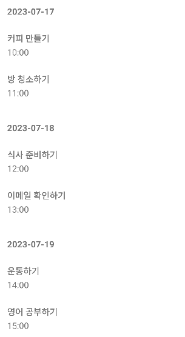
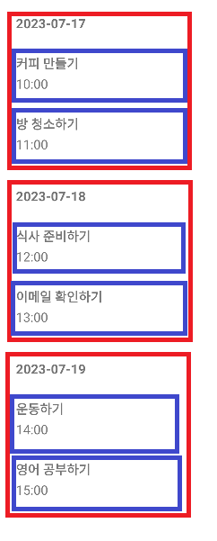

친구가 한번 해보라고 과제 테스트를 신청해서 '음.. 안되겠지만 일단 한 번 해볼까?' 하는 마음에 신청해서 준비랄 것도 없이 냅다 과제 테스트를 봤다. 처음 보는 과제 테스트여서 긴장아닌 긴장을 좀 했었다.

요구사항은 예를 들어서 투두 리스트라고 하면

-   투두 리스트를 날짜별로 표시
-   투두 목록을 클릭하면 할 일을 볼 수 있는 액티비티로 이동

처음에는 단순히 리사이클러뷰를 여러번 쓸 생각이었는데, 노가다로 레이아웃 짤거면 왜 과제테스트겠어? 하고 호기롭게 전부 지우고 다시 시작. 하지만 삽질 하다가 시간을 다 써버려서.. 다 풀진 못했지만 똑같은걸로 다시 삽질하지 않기 위해서 기록한다.

___

노가다로 레이아웃을 만들어서 리사이클러뷰 여러번 사용한다고 생각해보자.

1.  리사이클러뷰를 여러 개 만들어서, 각각의 리사이클러뷰가 하나의 날짜를 담당하게 한다.
2.  각 리사이클러뷰 안에는 해당 날짜의 할 일 목록을 넣는다.

하지만 이 방법은 당연하게도 코드 관리 측면에서 비효율적이다. 날짜나 할 일이 계속해서 추가될수록 코드가 길어지고, 레이아웃 관리가 어려워질 것이다. 리스트를 효율적으로 보여주기 위해서 리사이클러뷰를 쓰는 것과 똑같다.

따라서 중첩해서 리사이클러뷰를 사용하는 것이 더 효율적이다.

## 그러면 어떻게 구현할까?

먼저 날짜들이 나올 리사이클러뷰를 만들고, 그 날짜 리사이클러뷰의 아이템안에 리사이클러뷰를 넣어야 한다.

아래 그림에서 빨간색으로 표시한 부분이 부모 리사이클러뷰, 파란색이 자식 리사이클러뷰라고 볼 수 있다.





예시를 위한 거니까 UI는 대충...

## 투두 리스트를 날짜별로 표시

먼저, 날짜별로 나눌 수 있는 DatesAdapter를 만들어서 날짜를 관리한다. 그리고 각 날짜 아이템 안에 할 일을 담당하는 TasksAdapter를 넣어서 중첩 리사이클러뷰를 구현한다.   

먼저 부모 리사이클러뷰가 될 날짜 리사이클러뷰의 어댑터를 보자.

```kotlin
class DatesAdapter(
  private val dateList: ArrayList<Dates>,
  private val onItemClickListener: TasksAdapter.OnItemClickListener
) : RecyclerView.Adapter<DatesAdapter.DateViewHolder>() {

  inner class DateViewHolder(val binding: ItemDatesBinding) : RecyclerView.ViewHolder(binding.root) {
  fun bind(date: Dates) {
    binding.itemName.text = date.date
  }
}

override fun onCreateViewHolder(parent: ViewGroup, viewType: Int): DateViewHolder {
  val binding = ItemDatesBinding.inflate(LayoutInflater.from(parent.context), parent, false)
  return DateViewHolder(binding)
}

override fun onBindViewHolder(holder: DateViewHolder, position: Int) {
  holder.bind(dateList[position])
  val tasksAdapter = TasksAdapter(dateList[position].taskList, onItemClickListener, position)
  holder.binding.ItemTasksList.layoutManager = LinearLayoutManager(holder.binding.ItemTasksList.context)
  holder.binding.ItemTasksList.adapter = tasksAdapter
}

override fun getItemCount(): Int = dateList.size
}
```

`onBindViewHolder`에서는 자식 리사이클러뷰가 될 `TasksAdapter`를 선언하고 현재 날짜의 위치(position)을 `TasksAdapter`에 전달한다. 이렇게 하면, 각 날짜 리사이클러뷰의 아이템마다 각각 할 일 목록을 볼 수 있다.

```kotlin
class TasksAdapter(
  private val taskList: ArrayList<Tasks>,
  private val onItemClickListener: OnItemClickListener,
  private val datePosition: Int
) : RecyclerView.Adapter<TasksAdapter.TaskViewHolder>() {

  inner class TaskViewHolder(val binding: ItemTaskBinding) :
    RecyclerView.ViewHolder(binding.root) {
      fun bind(task: Tasks, position: Int) {
        binding.itemName.text = task.name
        binding.itemTime.text = task.time
      }
    }

  override fun onCreateViewHolder(parent: ViewGroup, viewType: Int): TaskViewHolder {
    val binding = ItemTaskBinding.inflate(LayoutInflater.from(parent.context), parent, false)
    return TaskViewHolder(binding)
  }

  override fun onBindViewHolder(holder: TaskViewHolder, position: Int) {
    holder.bind(taskList[position], position)
  }

  override fun getItemCount(): Int = taskList.size
}
```

TasksAdpater도 구현해준다.

## 투두 목록을 클릭하면 액티비티 이동

사실상 이 글을 쓰게 됐던 이유.. 삽질을 엄청 해댔다.

먼저 할 일을 클릭했을 때 정확하게 해당 날짜와 해당 할 일이 클릭될 수 있도록 클릭 리스너를 구현해야한다.

```kotlin
override fun onBindViewHolder(holder: TaskViewHolder, position: Int) {
  holder.bind(taskList[position], position)
  holder.binding.root.setOnClickListener {
    onItemClickListener.onClick(datePosition, position)
  }
}

interface OnItemClickListener {
  fun onClick(datePosition: Int, taskPosition: Int)
}
```

`TasksAdapter`는 `DatesAdapter`로부터 해당 날짜의 Task 목록, 위치와 클릭 리스너를 넘겨받는다.

`onBindViewHolder`에서는 `onItemClickListener` 인터페이스를 사용하여 아이템 클릭 이벤트를 처리한다. 클릭 이벤트 발생 시, `OnItemClickLIstener`의 `onClick` 메서드가 호출되고 날짜와 할일의 위치(position)을 전달하여 어떤 날짜의 어떤 할 일 아이템이 클릭되었는지 알 수 있다.      

그럼 이제 Activity에서 클릭 됐을 때 호출될 `onClick` 메서드를 액티비티를 이동할 수 있도록 정의해주면 된다.

```kotlin
val datesAdapter = DatesAdapter(dateList, object : TasksAdapter.OnItemClickListener {
  override fun onClick(datesPosition : Int, tasksPosition: Int) {
    startActivity(Intent(this@DateListActivity, TaskActivity::class.java)
      .putExtra("name", dateList[datesPosition].taskList[tasksPosition].name)
      .putExtra("price", dateList[datesPosition].taskList[tasksPosition].time))
  }
})
binding.activityDateList.layoutManager = LinearLayoutManager(this)
binding.activityDateList.adapter = datesAdapter
```

좀 복잡해보이지만, 중첩 리사이클러뷰에서 아이템 클릭 이벤트는 대략 다음과 같이 진행된다.

1.  우선 사용자가 `TasksAdapter`의 특정 아이템을 클릭하게 되면, 해당 아이템에서 설정해둔 `OnClickListener`가 동작하게 된다. 이 이벤트가 발생하면 `onClick` 메소드가 호출된다.
2.  이 `onClick` 메서드는 `OnItemClickListener` 인터페이스에 정의되어 있는데, 이 메서드는 날짜 아이템의 position과 할 일 아이템의 position을 받는다.
3.  `TasksAdapter`의 `onClick` 메서드가 호출되면 이 메소드는 다시 `DatesAdapter`의 `OnItemClickListener`를 호출한다. 이렇게 되면, 클릭된 아이템이 어떤 날짜에 위치한 어떤 할 일인지 정확히 알 수 있다.
4.  그리고 마지막으로 'DatesAdapter'의 'OnItemClickListener'에서는 실제로 사용자가 클릭한 아이템에 대한 처리를 수행한다. 예를 들면, 다른 액티비티로 이동시키거나, 상세 정보를 표시하거나, 특정한 동작을 수행하는 등의 작업이 있을 수 있다.
5.  어떤 작업을 수행할 지는 Activity에서 onClick 메서드를 정의해서 처리한다.

이렇게 중첩 리사이클러뷰에서도 각 아이템을 정확히 구분하고 클릭 이벤트를 처리할 수 있다.